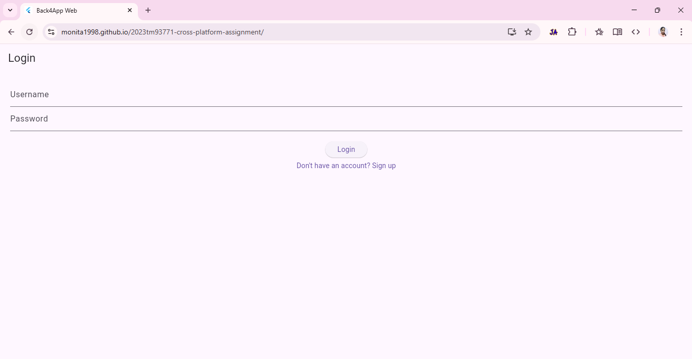
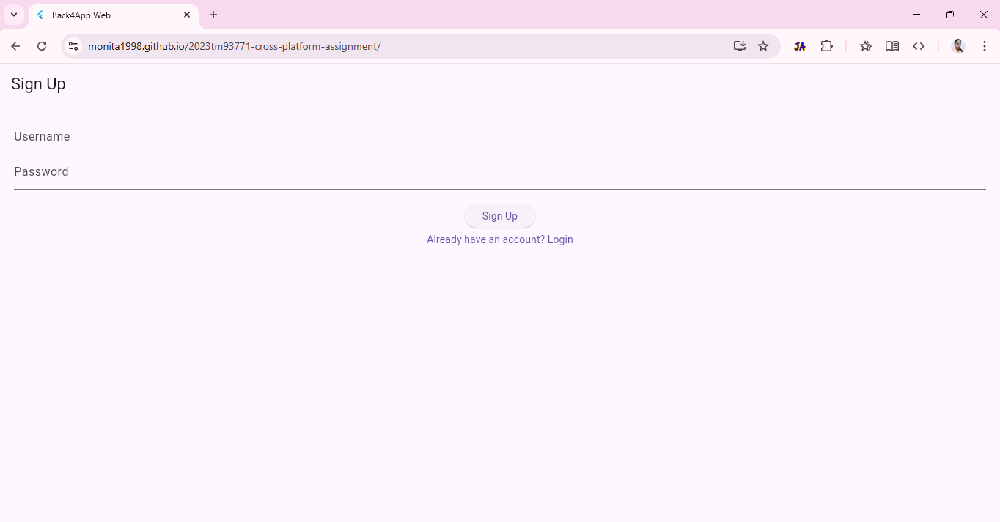
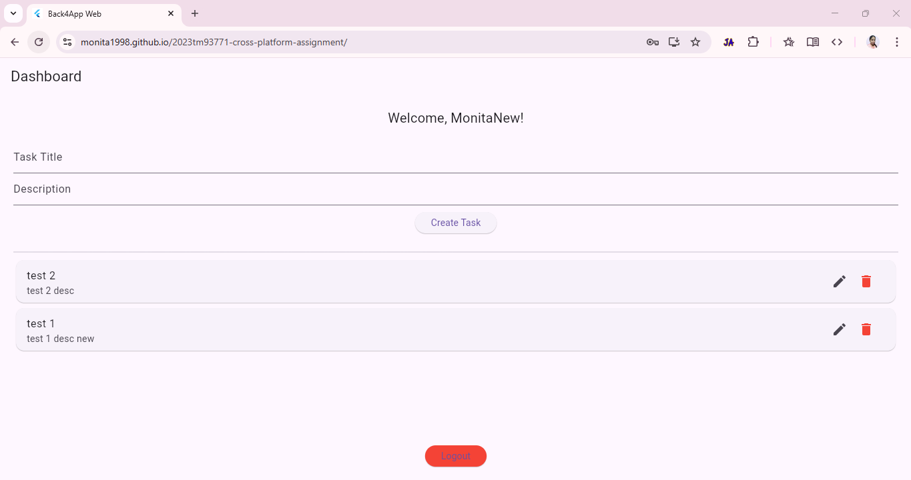

# Flutter CRUD App with Back4App Integration

## 📋 Overview

This Flutter application integrates with **Back4App** using the **Parse SDK** to provide user authentication and full CRUD (Create, Read, Update, Delete) operations on a cloud-based database.

---

## 🚀 Features

- **User Authentication**:
  - Sign up with username/email and password
  - Log in and maintain session state
  - Optional password reset flow

- **CRUD Operations**:
  - Add, update, view, and delete records (Name and Age)
  - Form validation (Age must be numeric)
  - Responsive and interactive UI

---

## 🛠️ Technologies Used

- **Flutter**
- **Dart**
- **Back4App (Parse Platform)**
- **parse_server_sdk_flutter**

---

## 📦 Project Structure

lib/
├── main.dart             # Initializes Parse and controls app flow
├── auth_page.dart        # Login/Signup UI and authentication logic
└── dashboard_page.dart   # UI for CRUD operations after login

---

## 📸 Screenshots

Login Screen → Dashboard with list and form → Edit/Delete actions

### 🔐 Login Page

---

### 📝 Signup Page

---

### 📋 Dashboard Page

### 📞 Contact
For any questions or issues, please reach out at **monitamoni132@gmail.com**
